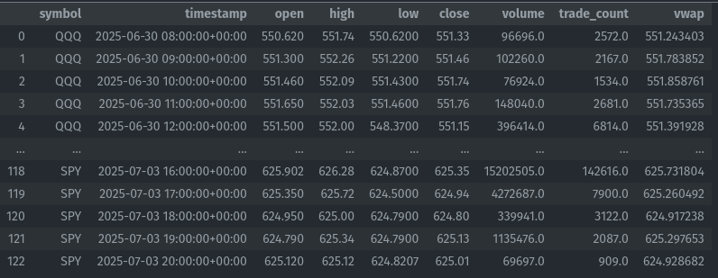
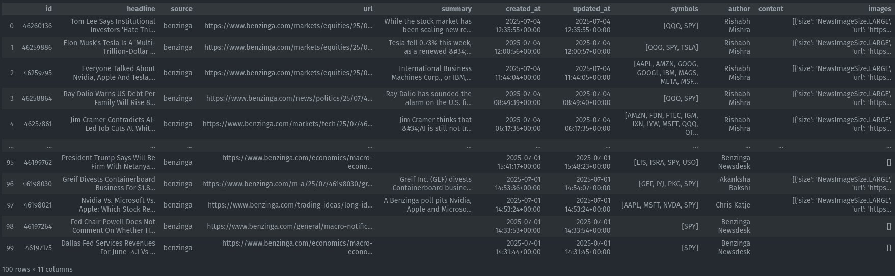
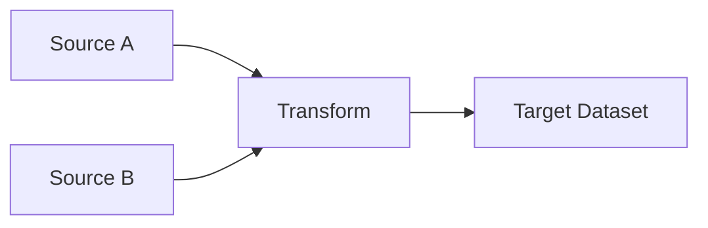

# Data Documentation

The data for training our financial model comes from the Alpaca [NewsClient](https://docs.alpaca.markets/reference/news-3) and the Alpaca [HistoricalDataClient](https://docs.alpaca.markets/reference/stockbars)

Historical price data is accessed via...
```python
from alpaca.data.historical import StockHistoricalDataClient
from alpaca.data.requests import StockBarsRequest
from alpaca.data.timeframe import TimeFrame
from datetime import datetime, timedelta
from src.config.settings import settings

stock_data_client = StockHistoricalDataClient(
    api_key=settings.apca_paper_api_key_id,
    secret_key=settings.apca_paper_api_secret_key
)

end_date = datetime.now() - timedelta(minutes=15) # Latest data with 15 min buffer
start_date = end_date - timedelta(days=5*1.5)  # Buffer for weekends/holidays
request = StockBarsRequest(
    symbol_or_symbols=["SPY", "QQQ"],
    timeframe=TimeFrame.Hour,  # Use Hourly timeframe for better granularity
    start=start_date,
    end=end_date,
    feed='sip', # SIP stands for Securities Information Processor, which provides consolidated data. Better than 'iex'
    asof=None,  # Use 'asof' to get the latest available data including extended hours
    adjustment='raw',  # Use 'raw' to get unadjusted prices
)

bars = stock_data_client.get_stock_bars(request)
df = bars.df.reset_index(); df
```


Historical news data is accessed via...
```python
from alpaca.data.historical.news import NewsClient
from alpaca.data.requests import NewsRequest
from datetime import datetime, timedelta
from src.config.settings import settings

news_client = NewsClient(
    api_key=settings.apca_paper_api_key_id,
    secret_key=settings.apca_paper_api_secret_key
)

end_date = datetime.now()
start_date = end_date - timedelta(days=10)
request = NewsRequest(
    symbols="SPY",
    start=start_date,
    end=end_date,
    limit=100,
)

news = news_client.get_news(request)
news_df = news.df.reset_index(); news_df
```



## Data Acquisition

We clone the data directly from the Alpaca APIs and push it directly into two separate tables `prices` and `news`. 

- There are initialization scripts that build the database and the tables if they don't exist
- There are population scripts that pull the historical data from the Alpaca APIs and populate the database tables

Both the historical news data and the historical price data are persistently stored in the `postgres_data` volume - attached to the postgres service.

## Data Asset Overview
**Asset Name**: [Name of dataset/table/stream]
**Owner**: [Team/Individual responsible]
**Created**: [Date]
**Last Updated**: [Date]
**Status**: [Active/Deprecated/Under Development]

## Business Context
**Purpose**: [Why this data exists and how it's used]
**Business Impact**: [What business decisions depend on this data]
**Stakeholders**: [Who uses this data and how]

## Data Schema
### Fields/Columns
| Field Name | Data Type | Description | Constraints | Business Rules |
|------------|-----------|-------------|-------------|----------------|
| field_1 | string | ... | NOT NULL | ... |
| field_2 | integer | ... | >0 | ... |

### Data Quality Metrics
- **Completeness**: [% of non-null values expected]
- **Accuracy**: [Validation rules and thresholds]
- **Timeliness**: [Expected update frequency and SLA]
- **Consistency**: [Cross-field validation rules]

## Data Lineage
### Upstream Dependencies
| Source System | Source Table/API | Transformation Logic | Update Frequency |
|---------------|------------------|---------------------|------------------|
| CRM System | customers | Direct copy | Daily |
| Web Analytics | events | Aggregated by session | Hourly |

### Downstream Usage
| Target System | Target Table | Consumer | Purpose |
|---------------|--------------|----------|---------|
| Data Warehouse | dim_customers | BI Team | Reporting |
| ML Platform | features_table | Data Science | Model Training |

### Transformation Pipeline
