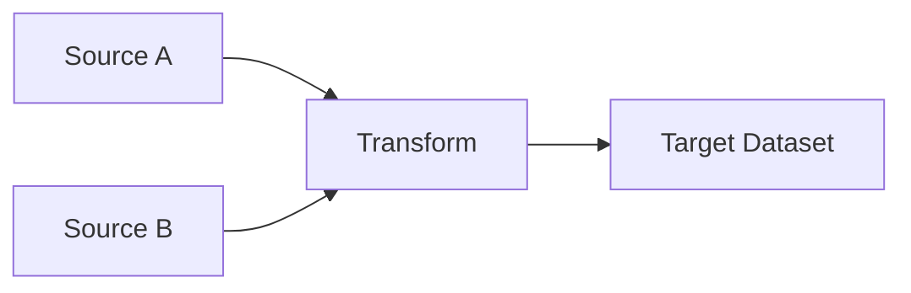

# Data Documentation Template

## Data Asset Overview
**Asset Name**: [Name of dataset/table/stream]
**Owner**: [Team/Individual responsible]
**Created**: [Date]
**Last Updated**: [Date]
**Status**: [Active/Deprecated/Under Development]

## Business Context
**Purpose**: [Why this data exists and how it's used]
**Business Impact**: [What business decisions depend on this data]
**Stakeholders**: [Who uses this data and how]

## Data Schema
### Fields/Columns
| Field Name | Data Type | Description | Constraints | Business Rules |
|------------|-----------|-------------|-------------|----------------|
| field_1 | string | ... | NOT NULL | ... |
| field_2 | integer | ... | >0 | ... |

### Data Quality Metrics
- **Completeness**: [% of non-null values expected]
- **Accuracy**: [Validation rules and thresholds]
- **Timeliness**: [Expected update frequency and SLA]
- **Consistency**: [Cross-field validation rules]

## Data Lineage
### Upstream Dependencies
| Source System | Source Table/API | Transformation Logic | Update Frequency |
|---------------|------------------|---------------------|------------------|
| CRM System | customers | Direct copy | Daily |
| Web Analytics | events | Aggregated by session | Hourly |

### Downstream Usage
| Target System | Target Table | Consumer | Purpose |
|---------------|--------------|----------|---------|
| Data Warehouse | dim_customers | BI Team | Reporting |
| ML Platform | features_table | Data Science | Model Training |

### Transformation Pipeline
